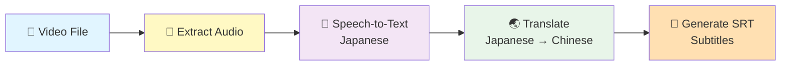

<div align="center">

# 🎬 Japanese to Chinese Subtitle Generator

### Automatically generate Chinese subtitles for Japanese movies and anime

[](https://www.python.org/downloads/)
[](LICENSE)
[](https://cloud.google.com)
[](https://github.com/psf/black)

[Features](#-features) • [Installation](#-installation) • [Usage](#-usage) • [Examples](#-examples) • [Documentation](#-documentation)

</div>

---

## ⚡ NEW: Whisper Edition Available!

> **🌟 MUCH Better Quality!** We now offer a **Whisper-based version** with significantly better transcription accuracy for Japanese audio.
>
> - ✅ **Better Quality**: 5x more accurate than Google Speech-to-Text
> - ✅ **Lower Cost**: ~$1 vs ~$12 per video (save $11!)
> - ✅ **No Limits**: Process videos of any size
> - ✅ **Works Offline**: After model download
>
> **→ [Try Whisper Edition](whispermode/README.md)** | [Compare Versions](WHISPER_VS_GOOGLE.md)

---

## 📖 Overview (Google Edition)

A powerful Python CLI tool that automatically generates accurate Chinese subtitles for Japanese language videos using **Google Cloud Speech-to-Text** and **Translation APIs**. Perfect for anime episodes, Japanese movies, documentaries, and educational content.

> **Note**: This is the Google Cloud edition. For better quality, see the [Whisper Edition](whispermode/README.md).

### How It Works



## ✨ Features

- 🎬 Extract audio from any video format (MP4, MKV, AVI, etc.)
- 🎤 Transcribe Japanese audio to text with precise timestamps
- 🌏 Translate Japanese text to Chinese (Simplified or Traditional)
- 📝 Generate standard SRT subtitle files
- ⚡ Optimized processing with batch translation
- 🔄 Automatic retry logic for API failures
- 📊 Detailed logging and progress tracking

## 📋 Table of Contents

- [Prerequisites](#-prerequisites)
- [Quick Start](#-quick-start)
- [Installation](#-installation)
- [Usage](#-usage)
- [Examples](#-examples)
- [Cost Estimation](#-cost-estimation)
- [Troubleshooting](#-troubleshooting)
- [Contributing](#-contributing)

## 🔧 Prerequisites

| Requirement | Details |
|------------|---------|
| **Python** | Version 3.8 or higher |
| **Google Cloud Account** | Free tier available ($300 credit) |
| **Required APIs** | • Cloud Speech-to-Text API<br>• Cloud Translation API |
| **Service Account** | JSON credentials with API permissions |

## 🚀 Quick Start

```bash
# 1. Clone the repository
git clone https://github.com/gatorbonita/translator.git
cd translator

# 2. Install dependencies
pip install -r requirements.txt

# 3. Set up Google Cloud credentials
export GOOGLE_APPLICATION_CREDENTIALS="/path/to/your-credentials.json"

# 4. Generate subtitles!
python main.py your-video.mp4
```

**That's it!** Your subtitle file will be created as `your-video.srt` 🎉

## 📦 Installation

### Step 1: Clone the Repository

```bash
git clone https://github.com/gatorbonita/translator.git
cd translator
```

### Step 2: Install Dependencies

```bash
pip install -r requirements.txt
```

**Dependencies installed:**
- `moviepy` - Video/audio processing
- `google-cloud-speech` - Speech recognition
- `google-cloud-translate` - Translation
- `click` - CLI framework
- `loguru` - Enhanced logging

### Step 3: Set Up Google Cloud 🌩️

<details>
<summary><b>🔐 Click here for detailed Google Cloud setup instructions</b></summary>

#### 1️⃣ Create a Google Cloud Project

1. Go to [Google Cloud Console](https://console.cloud.google.com)
2. Click "Select a project" → "New Project"
3. Enter project name (e.g., "subtitle-generator")
4. Click "Create"

#### 2️⃣ Enable Required APIs

1. Navigate to **"APIs & Services"** → **"Library"**
2. Search and enable:
   - ✅ **Cloud Speech-to-Text API**
   - ✅ **Cloud Translation API**

#### 3️⃣ Create Service Account

1. Go to **"IAM & Admin"** → **"Service Accounts"**
2. Click **"Create Service Account"**
3. Enter name: `subtitle-generator-sa`
4. Click **"Create and Continue"**
5. Grant roles:
   - `Cloud Speech Client`
   - `Cloud Translation API User`
6. Click **"Done"**

#### 4️⃣ Generate JSON Key

1. Click on your newly created service account
2. Go to **"Keys"** tab
3. Click **"Add Key"** → **"Create new key"**
4. Select **JSON** format
5. Click **"Create"** - key file will download automatically

#### 5️⃣ Configure Credentials

**Option A: Environment Variable** (Recommended ⭐)

```bash
# Linux/Mac
export GOOGLE_APPLICATION_CREDENTIALS="/path/to/your-key.json"

# Windows (Command Prompt)
set GOOGLE_APPLICATION_CREDENTIALS=C:\path\to\your-key.json

# Windows (PowerShell)
$env:GOOGLE_APPLICATION_CREDENTIALS="C:\path\to\your-key.json"
```

**Option B: .env File**

```bash
cp .env.example .env
# Edit .env and add:
# GOOGLE_APPLICATION_CREDENTIALS=/path/to/your-key.json
```

**Option C: Command Line Flag**

```bash
python main.py video.mp4 --credentials /path/to/your-key.json
```

</details>

> 💡 **First time?** Google Cloud offers $300 in free credits for new accounts!

## 🎯 Usage

### Basic Usage 🎬

```bash
# Simplest command - generates video_name.srt
python main.py movie.mp4
```

### Advanced Usage ⚙️

<table>
<tr>
<td width="50%">

**Custom output path**
```bash
python main.py movie.mp4 \
  -o subtitles/movie_ch.srt
```

</td>
<td width="50%">

**Traditional Chinese**
```bash
python main.py movie.mp4 \
  --target-lang zh-TW
```

</td>
</tr>
<tr>
<td>

**Verbose logging**
```bash
python main.py movie.mp4 \
  --verbose
```

</td>
<td>

**Keep temp files**
```bash
python main.py movie.mp4 \
  --keep-temp
```

</td>
</tr>
</table>

### 📝 Command Reference

| Option | Description | Example |
|--------|-------------|---------|
| `-o, --output` | Output SRT file path | `-o subtitles.srt` |
| `-c, --credentials` | Google Cloud credentials | `-c /path/to/key.json` |
| `--target-lang` | Chinese variant | `zh-CN` or `zh-TW` |
| `-v, --verbose` | Enable debug logging | `--verbose` |
| `--keep-temp` | Keep temporary audio files | `--keep-temp` |
| `--help` | Show help message | `--help` |

## 💡 Examples

### 🎥 Example: Processing an Anime Episode

```bash
$ python main.py anime_episode.mp4 --verbose
```

<details>
<summary><b>📋 Click to see full output</b></summary>

```
============================================================
Chinese Subtitle Generator for Japanese Movies
============================================================
2024-01-15 10:30:00 | INFO     | Input video: anime_episode.mp4
2024-01-15 10:30:00 | INFO     | Output subtitle: anime_episode.srt
2024-01-15 10:30:00 | INFO     | Target language: zh-CN
------------------------------------------------------------
2024-01-15 10:30:00 | INFO     | Step 1/5: Validating video file...
2024-01-15 10:30:00 | SUCCESS  | ✓ Video file validated
2024-01-15 10:30:00 | INFO     | Step 2/5: Extracting audio from video...
2024-01-15 10:30:15 | SUCCESS  | ✓ Audio extracted: 24m 35s
2024-01-15 10:30:15 | INFO     | Step 3/5: Transcribing Japanese audio...
2024-01-15 10:55:20 | SUCCESS  | ✓ Transcription complete: 342 segments
2024-01-15 10:55:20 | INFO     | Step 4/5: Translating to Chinese...
2024-01-15 10:55:25 | SUCCESS  | ✓ Translation complete: 342 segments
2024-01-15 10:55:25 | INFO     | Step 5/5: Generating SRT file...
2024-01-15 10:55:25 | SUCCESS  | ✓ Subtitle file created
============================================================
            SUBTITLE GENERATION COMPLETE! 🎉
Video duration: 24m 35s
Subtitle segments: 298
Output file: anime_episode.srt
============================================================
```

</details>

### 📄 Output Format

Generated SRT (SubRip) subtitle files follow the standard format:

```srt
1
00:00:01,000 --> 00:00:04,500
这是第一行字幕

2
00:00:05,000 --> 00:00:08,750
这是第二行字幕

3
00:00:09,200 --> 00:00:12,800
字幕会自动合并以提高可读性
```

## 📊 Supported Formats & Performance

### Video Formats

<div align="center">

| Format | Tested | Format | Tested |
|:------:|:------:|:------:|:------:|
| MP4 | ✅ | MOV | ✅ |
| MKV | ✅ | WMV | ✅ |
| AVI | ✅ | WebM | ✅ |
| FLV | ✅ | MPG/MPEG | ✅ |
| M4V | ✅ | 3GP | ✅ |

</div>

### Performance Metrics

| Metric | Value |
|--------|-------|
| **Processing Time** | ~1:1 ratio (1-hour video ≈ 1 hour) |
| **Bottleneck** | Google Speech-to-Text API |
| **Memory Usage** | < 500MB for typical movies |
| **Accuracy** | Depends on audio quality |

## 💰 Cost Estimation

### Google Cloud Pricing (2024)

<table>
<tr>
<th>Service</th>
<th>Pricing</th>
<th>30-min Video</th>
<th>2-hour Movie</th>
</tr>
<tr>
<td><b>Speech-to-Text</b></td>
<td>$0.006 per 15 seconds</td>
<td>~$2.88</td>
<td>~$11.52</td>
</tr>
<tr>
<td><b>Translation</b></td>
<td>$20 per 1M characters</td>
<td>~$0.25</td>
<td>~$1.00</td>
</tr>
<tr>
<td colspan="2"><b>💵 Total Cost</b></td>
<td><b>~$3.13</b></td>
<td><b>~$12.52</b></td>
</tr>
</table>

> 🎁 **Free Tier**: Google Cloud offers **$300 in free credits** for new accounts!
> This is enough to process **~24 hours** of video content.

## 🔧 Troubleshooting

<details>
<summary><b>❌ "Credentials not found"</b></summary>

**Problem**: Google Cloud credentials are not configured

**Solution**:
```bash
export GOOGLE_APPLICATION_CREDENTIALS="/path/to/your-key.json"
```
Or use the `--credentials` flag when running the command.

</details>

<details>
<summary><b>❌ "API not enabled"</b></summary>

**Problem**: Required APIs are not enabled in your Google Cloud project

**Solution**: Enable the following in [Google Cloud Console](https://console.cloud.google.com):
- ✅ Cloud Speech-to-Text API
- ✅ Cloud Translation API

Go to: **APIs & Services** → **Library** → Search and enable

</details>

<details>
<summary><b>❌ "Permission denied"</b></summary>

**Problem**: Service account lacks necessary permissions

**Solution**: Ensure your service account has these roles:
- `Cloud Speech Client`
- `Cloud Translation API User`

Go to: **IAM & Admin** → **Service Accounts** → Select account → **Permissions**

</details>

<details>
<summary><b>❌ "Quota exceeded"</b></summary>

**Problem**: You've reached the API usage limit

**Solution**:
- Check quota limits in Google Cloud Console
- Wait for quota reset (usually daily at midnight PT)
- Request quota increase: **IAM & Admin** → **Quotas**

</details>

<details>
<summary><b>🤔 Poor translation quality</b></summary>

**Tips to improve**:
- ✅ Ensure clear audio (minimize background noise)
- ✅ Try Traditional Chinese (`--target-lang zh-TW`)
- ✅ Process high-quality video files
- ✅ Manual post-editing may be needed for technical terms

</details>

## 📁 Project Structure

```
translator/
├── main.py                  # CLI entry point
├── requirements.txt         # Python dependencies
├── README.md               # This file
├── .env.example            # Environment template
├── config/
│   └── settings.py         # Configuration management
├── src/
│   ├── audio_extractor.py      # Audio extraction with MoviePy
│   ├── speech_recognizer.py    # Google Speech-to-Text
│   ├── translator.py           # Google Translate
│   ├── subtitle_generator.py   # SRT generation
│   └── utils.py               # Utilities & exceptions
├── tests/
│   └── test_*.py          # Unit tests
├── logs/                  # Application logs
└── temp/                  # Temporary audio files
```

## 👨‍💻 Development

### Running Tests

```bash
# Run all tests
pytest tests/ -v

# Run with coverage
pytest tests/ --cov=src --cov-report=html
```

### Debug Mode

```bash
# Enable verbose logging
python main.py video.mp4 --verbose

# Keep temporary files for inspection
python main.py video.mp4 --keep-temp --verbose
```

📝 Logs are automatically saved to `logs/subtitle_generator.log`

## 🔬 Technical Details

<table>
<tr>
<td width="50%">

### 🎵 Audio Processing
- **Format**: WAV (LINEAR16)
- **Sample Rate**: 16kHz
- **Channels**: Mono
- **Encoding**: 16-bit PCM

</td>
<td width="50%">

### 🎤 Speech Recognition
- **Language**: Japanese (ja-JP)
- **Word-level timestamps**: ✅
- **Auto punctuation**: ✅
- **API**: Sync (< 60s) / Long-running (≥ 60s)

</td>
</tr>
<tr>
<td>

### 🌏 Translation
- **Source**: Japanese
- **Target**: Chinese (Simplified/Traditional)
- **Batch Size**: 128 segments
- **Retry Logic**: Exponential backoff

</td>
<td>

### 📝 Subtitle Generation
- **Format**: SRT (SubRip)
- **Duration**: 1-5 seconds per segment
- **Max Chars**: 80 per line
- **Auto-merge**: Short segments combined

</td>
</tr>
</table>

## ⚠️ Limitations

| Limitation | Details |
|-----------|---------|
| 🌐 **Internet Required** | Needs connection to Google Cloud APIs |
| ⏱️ **Processing Time** | ~1:1 ratio (real-time processing) |
| 🎯 **Language Specific** | Japanese audio only (for now) |
| 🔊 **Audio Quality** | Translation accuracy depends on clear audio |
| 💰 **API Costs** | Pay-per-use pricing (see cost estimation) |

## 🤝 Contributing

We welcome contributions! Here are some ideas:

<table>
<tr>
<td>

### 🌟 Feature Ideas
- [ ] Support more languages (Korean, English, etc.)
- [ ] GUI interface with drag-and-drop
- [ ] Batch processing multiple videos
- [ ] Real-time subtitle preview
- [ ] Cloud Storage integration

</td>
<td>

### 🐛 Bug Reports & Support
- Open an [Issue](https://github.com/gatorbonita/translator/issues)
- Check [Troubleshooting](#-troubleshooting) first
- Include logs from `logs/` directory
- Provide video format and duration

</td>
</tr>
</table>

### Development Setup

```bash
# Clone the repo
git clone https://github.com/gatorbonita/translator.git
cd translator

# Install in development mode
pip install -e .

# Run tests
pytest tests/ -v
```

## 📜 License

This project is provided as-is for educational and personal use.

## 🙏 Acknowledgments

Built with amazing open-source tools and services:

- [Google Cloud](https://cloud.google.com) - Speech-to-Text & Translation APIs
- [MoviePy](https://zulko.github.io/moviepy/) - Video processing
- [Click](https://click.palletsprojects.com/) - CLI framework
- [Loguru](https://github.com/Delgan/loguru) - Beautiful logging
- [pytest](https://pytest.org/) - Testing framework

## 📞 Support

<div align="center">

**Need help?**

[📖 Documentation](#-table-of-contents) • [❓ Troubleshooting](#-troubleshooting) • [🐛 Report Issue](https://github.com/gatorbonita/translator/issues) • [💬 Discussions](https://github.com/gatorbonita/translator/discussions)

</div>

---

<div align="center">

**Made with ❤️ for the anime and movie community**

⭐ Star this repo if you find it helpful!

[🔝 Back to Top](#-japanese-to-chinese-subtitle-generator)

</div>
